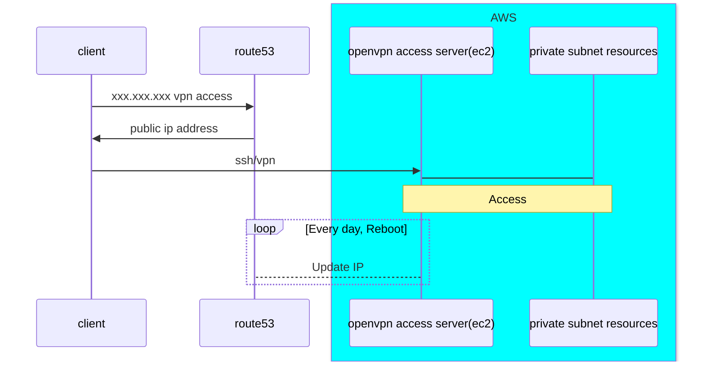

# amazon-openvpn-ddns
- Provide an alternative to set up OpenVPN Server in EC2.
- Enable Dynamic Domain Name mapping to changing Elastic IP due to stopped instance. 
- See example [here](/example/).

## Input Variables
|Variable name|Description|Default|
|---|---|---|
|AWS_REGION|AWS Service Region to deploy|eu-west-2|
|prefix|Project Name|
|vpc_id|VPC ID|
|openvpn_server_ami|Any Ubuntu AMI (tested in eu-west-2 ubuntu 22.04 amd64)|
|subnet_id|Subnet ID that OpenVPN server will be deployed to|
|instance_type|OpenVPN Server Instance type|t2.small|
|admin_pwd|Admin Password for OpenVPN Server|
|email|Email to register ssl certificate for your `subdomain.domain`|
|subdomain|Subdomain, like prefix of `api.google.com`, it is `api`|
|domain|Domain, like `google.com`|
|public_key_openssh|Generate your ssh key and put public key here|

## How to Launch? 
1. Run terraform to deploy.
    ```terraform
    terraform init
    terraform apply -auto-approve
    ```
2. Change your hostname when you have access to `subdomain.domain/admin`.
    - Configuration -> Network Settings -> Hostname or IP Address -> Enter your `subdomain.domain`.
3. Check VPN Settings.
    - EC2 should have a private ip address, like 10.1.2.214.
    - VPC cidr is 10.1.0.0/16.
    - Change Network Address to 10.1.16.0.
    - Group Default IP Address Network (Optional) to 10.1.16.0/20.
    - Have clients use specific DNS Servers -- YES : Primary 10.1.0.2
    - YES using NAT.
    - VERY IMPORTANT -- Specify the private subnets to which all clients should be given access (one per line).
    - VERY IMPORTANT -- Specify the network address to which does not conflict with any CIDR. For example, API on 10.1.16.0/21, avoid using 10.1.16.0 because it will make the openvpn unreachable to API. 


