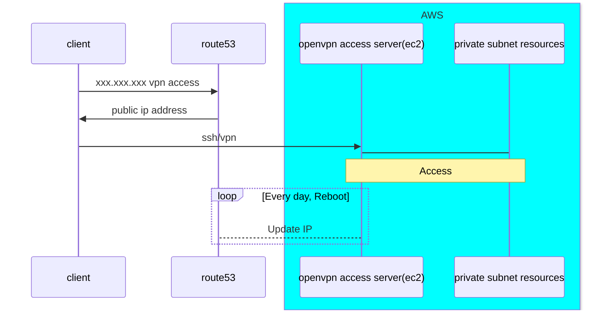

# amazon-openvpn-ddns

```mermaid
sequenceDiagram
  client->>route53: xxx.xxx.xxx vpn access
  route53->>client: public ip address
  box Aqua AWS
  participant openvpn access server(ec2)
  participant private subnet resources
  end
  client->>openvpn access server(ec2): ssh/vpn
  openvpn access server(ec2)->private subnet resources: 
  Note over openvpn access server(ec2),private subnet resources: Access
  loop Every day, Reboot
    openvpn access server(ec2)-->route53: Update IP
  end
```
